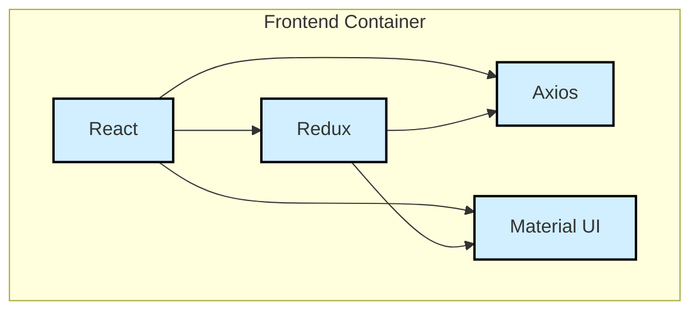

# System Design for Final Course Submission

## Overall Context

```mermaid
graph TD
  A[Musician A] -->|Uses| B[JamBuddy]
  C[Musician B] -->|Uses| B[JamBuddy]
  J[Admin User] -->|Uses| H[JamBuddy]

  subgraph "JamBuddy Frontend"
    style B fill:#D1EFFF,stroke:#000000,stroke-width:2px;
    B(JamBuddy) -->|Provides| D[Personal <br/>Ads]
    style D fill:#D1EFFF,stroke:#000000,stroke-width:2px;
    B -->|Allows| E[Audio/Video <br/>Samples]
    style E fill:#D1EFFF,stroke:#000000,stroke-width:2px;
    B -->|Includes| F[Review<br/> System]
    style F fill:#D1EFFF,stroke:#000000,stroke-width:2px;
    B -->|Searches| G[User <br/>Profiles]
    style G fill:#D1EFFF,stroke:#000000,stroke-width:2px;
  end

  subgraph "JamBuddy Admin"
    style H fill:#D1EFFF,stroke:#000000,stroke-width:2px;
    H(Admin Site) -->|Manages| I[Instrument <br/>Options]
    style I fill:#D1EFFF,stroke:#000000,stroke-width:2px;
    H(Admin Site) -->|Manages| K[Genre <br/>Options]
    style K fill:#D1EFFF,stroke:#000000,stroke-width:2px;
    H(Admin Site) -->|Manages| L[Experience <br/>Level <br/>Options]
    style L fill:#D1EFFF,stroke:#000000,stroke-width:2px;
  end

  ```

## Container Structure


```mermaid
graph LR
  subgraph "Code Storage"
    style GitHub fill:#D1EFFF,stroke:#000000,stroke-width:2px;
    GitHub
  end

  subgraph "Data Storage"
    style ElephantSQL fill:#D1EFFF,stroke:#000000,stroke-width:2px;
    ElephantSQL
  end

  subgraph "Frontend"
    style Vercel fill:#D1EFFF,stroke:#000000,stroke-width:2px;
    Vercel
  end


  subgraph "Backend"
    style DigitalOcean fill:#D1EFFF,stroke:#000000,stroke-width:2px;
    DigitalOcean
  end

  subgraph "Local"
    style Docker fill:#D1EFFF,stroke:#000000,stroke-width:2px;
    Docker
  end

  Docker -->|Push Code| GitHub


  GitHub -->|Deploy Code| Vercel
  GitHub -->|Deploy Code| DigitalOcean
  Vercel -->|Request Data| DigitalOcean
  DigitalOcean -->|Return Data| Vercel
  DigitalOcean -->|Request Data| ElephantSQL
  ElephantSQL -->|Return Data| DigitalOcean
  ```


## Component Structure
```mermaid
flowchart TD
  subgraph "Backend Container"
    A[Django]
    B[Django Rest Framework]
    C[Pytest]
    D[Django Cors Headers]
    E[Psycopg2]
    F[Zipcode API]
  end

  A --> B
  A --> D
  A --> E
  B --> C
  B --> D
  B --> E
  A --> F


  style A fill:#D1EFFF,stroke:#000000,stroke-width:2px;
  style B fill:#D1EFFF,stroke:#000000,stroke-width:2px;
  style C fill:#D1EFFF,stroke:#000000,stroke-width:2px;
  style D fill:#D1EFFF,stroke:#000000,stroke-width:2px;
  style E fill:#D1EFFF,stroke:#000000,stroke-width:2px;
  style F fill:#D1EFFF,stroke:#000000,stroke-width:2px;

```

