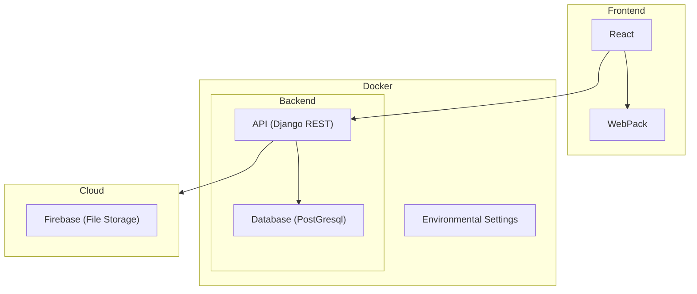

# Overall System Design Diagram

```mermaid
flowchart TB

    subgraph Frontend
    React-->WebPack
    end

    React-->API

    subgraph Docker
    env[Environmental Settings]
    subgraph Backend
    API["API (Django REST)"]-->DB
    DB["Database (PostGresql)"]
    end
    end

    API-->Cloud

    subgraph Cloud
    Storage["Firebase (File Storage)"]
    end
```
